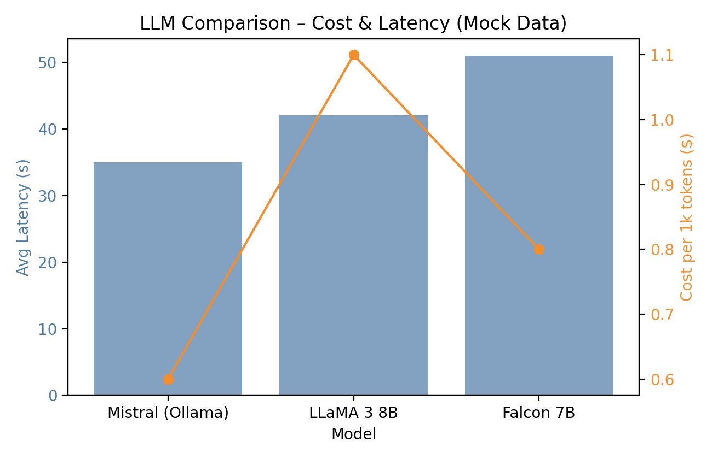
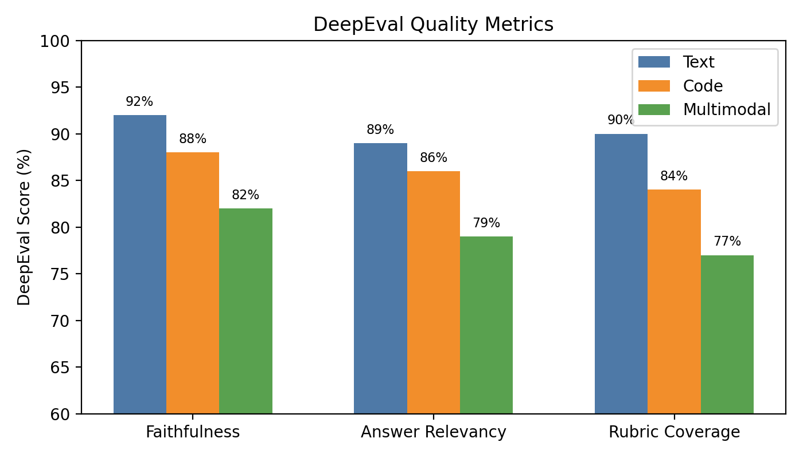

# Thesis Figure Reference

This document gathers every raster figure referenced in the thesis so you can preview them quickly or drop them into the PDF manual if the build pipeline skips them. All image paths are relative to the repository root.

## Usage
- Copy the suggested LaTeX snippet under each entry when you need to inline the figure manually.
- Regenerate any figure by running:
  ```bash
  python evaluation_reports/generate_raw_data.py
  python evaluation_reports/export_datasets.py
  python evaluation_reports/generate_figures.py
  ```
- If a figure is marked as **missing**, rerun the commands above before the final PDF pass.

---

### `graphics/hhn_en.png` - University Mark *(cover page)*
- **Status:** **missing** (add the image to `graphics/hhn_en.png` before compiling).
- **Suggested LaTeX:**

```latex
\includegraphics{graphics/hhn_en.png}
```

---

### `evaluation_reports/figure_llm_accuracy.png` - LLM Comparison (Accuracy)


```latex
\begin{figure}[htbp]
  \centering
  \includegraphics[width=\textwidth]{evaluation_reports/figure_llm_accuracy.png}
  \caption{Comparative LLM accuracy across benchmark tasks.}
  \label{fig:llm_accuracy}
\end{figure}
```

---

### `evaluation_reports/figure_llm_cost_latency.png` - LLM Latency & Cost


```latex
\begin{figure}[htbp]
  \centering
  \includegraphics[width=\textwidth]{evaluation_reports/figure_llm_cost_latency.png}
  \caption{Latency and token cost snapshot for candidate LLMs.}
  \label{fig:llm_cost_latency}
\end{figure}
```

---

### `evaluation_reports/figure_human_vs_ai_gap.png` - Human vs AI Grading Gap


```latex
\begin{figure}[htbp]
  \centering
  \includegraphics[width=\textwidth]{evaluation_reports/figure_human_vs_ai_gap.png}
  \caption{Average score deltas between lecturer grades and AI grades.}
  \label{fig:human_ai_gap}
\end{figure}
```

---

### `evaluation_reports/figure_deepeval_metrics.png` - DeepEval Metrics


```latex
\begin{figure}[htbp]
  \centering
  \includegraphics[width=\textwidth]{evaluation_reports/figure_deepeval_metrics.png}
  \caption{DeepEval quality metrics across assessment modalities.}
  \label{fig:deepeval_metrics}
\end{figure}
```

---

### `evaluation_reports/figure_explanation_lengths.png` - Explanation Lengths


```latex
\begin{figure}[htbp]
  \centering
  \includegraphics[width=\textwidth]{evaluation_reports/figure_explanation_lengths.png}
  \caption{Distribution of explanation lengths produced by the grading agents.}
  \label{fig:explanation_lengths}
\end{figure}
```

---

### `evaluation_reports/figure_confidence_scatter.png` - Confidence vs Disagreement


```latex
\begin{figure}[htbp]
  \centering
  \includegraphics[width=\textwidth]{evaluation_reports/figure_confidence_scatter.png}
  \caption{Confidence scores plotted against agent disagreement percentages.}
  \label{fig:confidence_scatter}
\end{figure}
```

---

### `evaluation_reports/figure_accuracy.png` - AI vs Lecturer Score Agreement


```latex
\begin{figure}[htbp]
  \centering
  \includegraphics[width=\textwidth]{evaluation_reports/figure_accuracy.png}
  \caption{Overall agreement between AI-generated scores and lecturer grades.}
  \label{fig:accuracy_overview}
\end{figure}
```

---

### `evaluation_reports/figure_turnaround.png` - Turnaround Time Trend


```latex
\begin{figure}[htbp]
  \centering
  \includegraphics[width=\textwidth]{evaluation_reports/figure_turnaround.png}
  \caption{Trend of grading turnaround time per cohort.}
  \label{fig:turnaround_trend}
\end{figure}
```

---

### `evaluation_reports/figure_usage.png` - Feature Usage Share


```latex
\begin{figure}[htbp]
  \centering
  \includegraphics[width=\textwidth]{evaluation_reports/figure_usage.png}
  \caption{Share of key Streamlit feature usage during evaluations.}
  \label{fig:feature_usage}
\end{figure}
```
