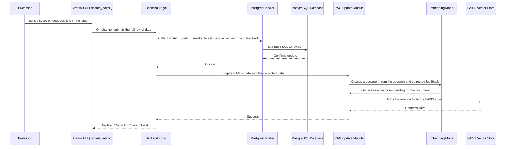

# Detailed Data Flow Diagrams

This document provides a series of detailed diagrams illustrating the data flow through every major pipeline in the Automated Grading Framework. 

---

## 1. Data Ingestion Pipeline (ETL)

This pipeline describes how course materials (from professors) and student submissions are processed from raw PDFs into structured, queryable data in the PostgreSQL database.

```mermaid
sequenceDiagram
    participant Prof as Professor
    participant Stu as Student
    participant UI as Streamlit UI (`st.file_uploader`)
    participant Parser as PDF Parser (`PyMuPDF`, `re`)
    participant Backend as Backend Logic (`1_upload_data.py`)
    participant DB as PostgresHandler
    participant PG as PostgreSQL Database

    box LightCyan Professor Workflow
        Prof->>UI: Uploads Professor PDF (Questions, Rubric)
        UI->>Backend: Passes file bytes
        Backend->>Parser: Extracts raw text from PDF
        Parser-->>Backend: Returns unstructured text
        Backend->>Parser: Parses text with Regex for structured content
        Parser-->>Backend: Returns structured data (JSON)
        Backend->>DB: Calls `execute_query` with INSERT for `prof_data`
        DB->>PG: Executes SQL INSERT statement
    end

    box LightYellow Student Workflow
        Stu->>UI: Uploads Submission PDF
        UI->>Backend: Passes file bytes
        Backend->>Parser: Extracts raw text from PDF
        Parser-->>Backend: Returns unstructured text
        Backend->>DB: Calls `execute_query` with INSERT for `student_data`
        DB->>PG: Executes SQL INSERT statement
    end
```

**Description:**

The ingestion process happens in two distinct (but similar) workflows:

*   **Professor Workflow:** 
    1. The professor uploads a PDF containing the assignment details.
    2. The backend uses `PyMuPDF` to extract text and regular expressions (`re`) to parse it into a structured format (questions, rubric, etc.).
    3. The structured data is saved to the `prof_data` table in the PostgreSQL database.

*   **Student Workflow:**
    1. The student uploads their submission as a PDF.
    2. The backend uses `PyMuPDF` to extract the raw text of their answer.
    3. This text is saved to the `student_data` table, linked to the appropriate assignment.

---

## 2. Core Grading Pipeline

This diagram shows the end-to-end process when a professor initiates a grading job, culminating in the results being displayed on the screen.

```mermaid
graph TD
    A[Start: User clicks "Grade" in UI] --> B{Backend Logic (`2_grading_result.py`)};
    B --> C[DB: Fetch submissions from `student_data`];
    B --> D[DB: Fetch rubric from `prof_data`];
    C --> E{AI Grading Engine};
    D --> E{AI Grading Engine};
    E --> F(See Agentic Pipeline for details);
    F --> G{Grading Result (Score, Feedback, Confidence)};
    G --> H[DB: `INSERT` result into `grading_results` table];
    H --> I[UI: Display results using `st.data_editor`];
    I --> J[End: User views grades];
```

**Description:**
1.  The process begins when the user starts a grading job from the Streamlit UI.
2.  The backend fetches the relevant student submissions and the corresponding professor-defined rubric from the PostgreSQL database.
3.  This data is dispatched as a job to the **AI Grading Engine**.
4.  The engine performs the complex grading task (detailed in the next section).
5.  The final, aggregated result is returned to the backend.
6.  The backend saves this result to the `grading_results` table for persistence.
7.  The UI is updated to display the new grades in an editable table, completing the flow.

---

## 3. Agentic Grading Engine Pipeline (Deep Dive)

This diagram provides a detailed look inside the AI Grading Engine itself, showing how a single submission is processed by the multi-agent system.

```mermaid
graph TD
    A[Grading Job Received] --> B{Router};
    B --> |Assignment type is 'text'| C{Multi-Agent Grader};
    B --> |Assignment type is 'code'| D{Code Grader};

    subgraph Code Grading Sandbox
        D --> D1[1. Create Dockerfile with student code & unittests];
        D1 --> D2[2. `docker build` & `docker run`];
        D2 --> D3[3. Capture stdout from unittest results];
        D3 --> D4[4. Parse results to get objective score];
        D4 --> D5{5. LLM Call for Qualitative Feedback};
        D5 --> D6[Final Code Grade];
    end

    subgraph Multi-Agent Text Grading
        C --> C1{1. RAG Module};
        C1 --> C2[Query FAISS Vector Store for similar past corrections];
        C2 --> C3[Retrieve context];
        
        C --> C4{2. Concurrent Agent Spawner (`ThreadPoolExecutor`)};
        C3 --> C4
        C4 --> |Job 1| Agent1[Grader Agent α (Strict)];
        C4 --> |Job 2| Agent2[Grader Agent β (Lenient)];
        C4 --> |Job N| AgentN[Grader Agent γ (By-the-book)];

        subgraph Single Agent Execution
            Agent1 --> P1{Prompt Builder};
            P1 -- "Submission, Rubric, Persona, RAG Context" --> L1[LangChain LLM Call];
            L1 --> R1[Agent α Result (Score, Feedback)];
        end

        R1 --> C5{3. Aggregator};
        Agent2 --> C5;
        AgentN --> C5;

        C5 --> C6[Calculate score (mean/median) & confidence (variance)];
        C5 --> C7{4. Meta-Agent LLM Call to synthesize all feedback};
        C6 --> C8[Final Text Grade];
        C7 --> C8[Final Text Grade];
    end

    D6 --> Z[End: Return Result];
    C8 --> Z[End: Return Result];
```

**Description:**
*   **Routing:** The engine first routes the job based on the assignment type.
*   **Code Grading:** For code, it enters a secure Docker sandbox to run unit tests for an objective score, then uses an LLM to generate qualitative feedback on the code itself.
*   **Text Grading:** For text, the process is more complex:
    1.  **RAG:** The RAG module first retrieves relevant historical grading examples from the FAISS vector store.
    2.  **Concurrent Grading:** Multiple AI agents, each with a different persona, are spawned in parallel. They each receive the submission, the rubric, and the context from the RAG module.
    3.  **Aggregation:** Once all agents complete, their individual scores are statistically aggregated (e.g., taking the median). The variance in their scores is used as a confidence metric.
    4.  **Synthesis:** A final "meta-agent" reviews the feedback from all other agents and synthesizes it into a single, high-quality, comprehensive piece of feedback for the student.

---

## 4. Human-in-the-Loop (HITL) & RAG Update Pipeline

This pipeline shows what happens when a professor makes a correction to an AI-generated grade. This is a critical feedback loop for the system.



**Description:**
1.  The professor edits a grade directly in the Streamlit UI.
2.  The backend receives the corrected data.
3.  It first updates the `grading_results` table in the PostgreSQL database, preserving both the original AI grade (`old_feedback`) and the new human-verified grade (`new_feedback`).
4.  Next, this correction is used to improve the RAG system. The corrected feedback is converted into a vector embedding.
5.  This new vector is added to the FAISS vector store, making this human-verified example available for all future grading tasks to improve their context and accuracy.

---

## 5. Model Finetuning Pipeline

This diagram illustrates the complete, user-driven workflow for fine-tuning the model, starting from the application UI and ending with a newly adapted model being loaded.

```mermaid
graph TD
    subgraph In Application UI
        A[Start: User opens "Finetuning Assistant" page] --> B{1. Clicks "Generate Training Data"};
        B --> C[Backend: Queries `grading_results` for all human corrections];
        C --> D[Backend: Formats data into JSONL prompt/response pairs];
        D --> E[UI: Enables `st.download_button`];
        E --> F{2. User downloads `training_dataset.jsonl`};
    end

    subgraph In Google Colab (External)
        F --> G[User uploads dataset to Colab];
        G --> H{3. User runs provided Python script};
        H --> I[Installs `mlx-lm`];
        I --> J[Splits data into train/valid/test sets];
        J --> K[Runs `mlx_lm.lora` fine-tuning process];
        K --> L[Outputs `trained_adapters.npz`];
        L --> M{4. User downloads `trained_adapters.npz`};
    end

    subgraph In Application Environment
        M --> N[User places file in the `/training` directory];
        N --> O{5. User restarts the Streamlit application};
        O --> P[App Startup Logic];
        P --> Q{Check if `training/trained_adapters.npz` exists};
        Q --> |Yes| R[Load base model AND LoRA adapters];
        Q --> |No| S[Load base model only];
        R --> T{End: Application now uses fine-tuned model};
        S --> T;
    end
```

**Description:**
1.  **Data Generation:** The user initiates the process in the UI. The application queries its own database for all human corrections and formats them into the specific JSONL format required by the training script.
2.  **Training:** The user takes this data file to a Google Colab environment and runs a provided script. This script handles all the technical details of the MLX fine-tuning process, creating a set of LoRA adapters (`trained_adapters.npz`) that encapsulate the learned corrections.
3.  **Deployment:** The user downloads these adapters and places them in the application's `training/` directory.
4.  **Activation:** The next time the application starts, it automatically detects the presence of this file and loads the adapters on top of the base model. All subsequent grading tasks will now be performed by this newly fine-tuned model, completing the self-improvement loop.
