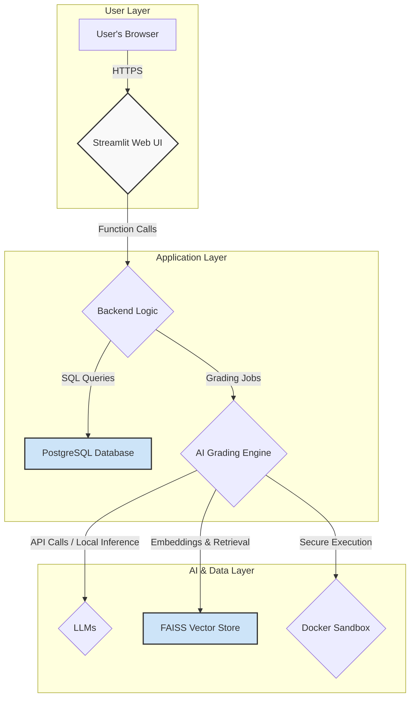
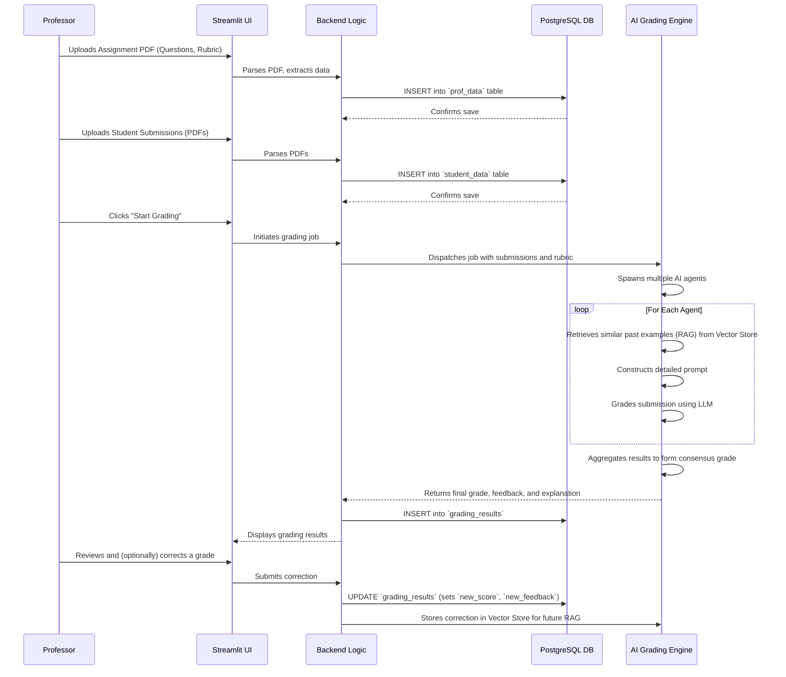

# Software Design Document

This document provides a detailed technical design for the Automated Grading Framework. It is divided into two main sections: a High-Level Design (HLD) that describes the overall system architecture and a Low-Level Design (LLD) that provides detailed specifications for each component.

---

## 1. High-Level Design (HLD)

The High-Level Design outlines the major components of the system, their interactions, and the technology stack.

### 1.1. System Architecture Overview

The application is a monolithic web application built on a multi-tiered architecture. It is designed for modularity to allow for future expansion and potential migration to a microservices-based architecture.



**Component Responsibilities:**

1.  **Streamlit Web UI (Frontend):** A multi-page application that serves as the primary user interface. It handles user input, authentication, data visualization, and presents the grading results. It is stateful within a user session.
2.  **Backend Logic (Integrated with Frontend):** In the current architecture, the backend logic is tightly coupled with the Streamlit frontend. It processes user requests, orchestrates database interactions via the `PostgresHandler`, and initiates grading jobs.
3.  **PostgreSQL Database:** The central repository for all persistent data. It stores user accounts, course materials, student submissions, and all grading results, including human-in-the-loop corrections.
4.  **AI Grading Engine:** The core of the system. It contains the logic for different grading modalities (text, code, etc.) and orchestrates the complex interactions between LLMs, RAG, and other AI components.
5.  **LLMs (Large Language Models):** The underlying intelligence. The system is designed to be model-agnostic, capable of interfacing with various local models (e.g., via MLX) or external APIs (like OpenAI or Google's Gemini).
6.  **FAISS Vector Store:** An on-disk vector database used to implement Retrieval Augmented Generation (RAG). It stores embeddings of past human-corrected gradings to improve future consistency.
7.  **Docker Sandbox:** A secure, containerized environment for executing untrusted student code against predefined unit tests, preventing any potential harm to the host system.

### 1.2. Technology Stack

| Component             | Technology/Framework  | Justification                                                                                             |
| --------------------- | --------------------- | --------------------------------------------------------------------------------------------------------- |
| **Frontend/Backend**  | Streamlit             | Enables rapid development of data-centric web applications with Python. Ideal for prototyping and internal tools. |
| **Database**          | PostgreSQL            | A robust, open-source relational database that handles structured data and complex queries effectively.     |
| **AI Orchestration**  | LangChain             | Simplifies the development of LLM-powered applications, particularly for multi-agent and RAG workflows.  |
| **Local AI/ML**       | MLX (for Apple Silicon) | A highly efficient framework for running machine learning models on Apple Silicon, used for local fine-tuning. |
| **PDF Processing**    | PyMuPDF (`fitz`)      | Chosen for its high speed and accuracy in extracting text and metadata from PDF files.                     |
| **Vector Store**      | FAISS (from Facebook AI) | An efficient library for similarity search and clustering of dense vectors, forming the core of the RAG module. |
| **Code Sandboxing**   | Docker                | The industry standard for creating isolated, reproducible environments, ensuring secure code execution.       |

### 1.3. User Roles and Permissions

Two primary user roles are defined within the system:

*   **Professor:** Has full access to the system. Can upload course materials, view all student submissions, initiate grading, review and modify AI-generated grades, view analytics, and manage the fine-tuning process.
*   **Student (Future Scope):** While the current system focuses on the professor's workflow, a student role would have restricted access, limited to uploading their own submissions and viewing their final, published grades.

### 1.4. Data Flow Diagram

This diagram illustrates the end-to-end flow for a typical text-based assignment grading task.



### 1.5. Future-State Cloud Architecture (Google Cloud)

For a production-grade system, migrating from a local, monolithic architecture to a scalable cloud-based one is recommended. Google Cloud offers a suite of services that align perfectly with this application's needs.

```mermaid
graph TD
    subgraph User & CDN
        A[User's Browser] --> B(Cloud CDN & Load Balancer)
    end
    
    subgraph Application Services
        B --> C{Cloud Run (Frontend)}
        B --> D{Cloud Functions (Backend API)}
    end

    subgraph Data & Storage
        C --> E[Cloud SQL for PostgreSQL]
        D --> E
        D --> F[Cloud Storage for PDF & Data Files]
    end

    subgraph AI Platform
        D --> G{Vertex AI Pipelines}
        G --> H(Vertex AI Model Garden / Custom Models)
        G --> I(Vertex AI Vector Search)
        G --> J(Secure Code Execution in Cloud Run Jobs)
    end

    C --> F
```

**Migration Benefits:**

*   **Scalability & Reliability:** Cloud Run and Cloud Functions automatically scale with traffic, including scaling to zero, which is highly cost-effective. Cloud SQL provides managed, high-availability PostgreSQL.
*   **Decoupled Frontend/Backend:** Separating the Streamlit frontend (served via Cloud Run) from the backend logic (refactored into API endpoints in Cloud Functions) creates a more robust and scalable microservices architecture.
*   **Centralized MLOps with Vertex AI:**
    *   **Vertex AI Pipelines:** The entire grading and fine-tuning workflow can be defined as a reproducible pipeline, making it easier to manage, version, and trigger.
    *   **Vertex AI Vector Search:** A fully managed, highly scalable, and low-latency vector database to replace the local FAISS store.
    *   **Model Management:** Use the Vertex AI Model Garden for pre-trained models or host custom-trained models, streamlining model deployment and versioning.
*   **Secure, Serverless Execution:** Replace the local Docker sandbox with ephemeral Cloud Run Jobs for even more secure and scalable code execution.

---

## 2. Low-Level Design (LLD)

The Low-Level Design provides detailed specifications for individual modules, data structures, and logic.

### 2.1. Database Schema (PostgreSQL)

Below is a detailed breakdown of the core tables. All text fields are `TEXT` to accommodate variable lengths. Timestamps are used for auditing.

**Table: `users`**

| Column          | Data Type             | Constraints                                   | Description                                   |
| --------------- | --------------------- | --------------------------------------------- | --------------------------------------------- |
| `id`            | `SERIAL`              | `PRIMARY KEY`                                 | Unique identifier for the user.               |
| `username`      | `VARCHAR(255)`        | `UNIQUE`, `NOT NULL`                          | User's chosen login name.                     |
| `password_hash` | `VARCHAR(255)`        | `NOT NULL`                                    | Hashed password for secure storage.           |
| `role`          | `VARCHAR(50)`         | `DEFAULT 'professor'`                         | User's role (e.g., 'professor').              |
| `created_at`    | `TIMESTAMP WITH TIME ZONE` | `DEFAULT CURRENT_TIMESTAMP`                   | Timestamp of account creation.                |

**Table: `prof_data`**

| Column          | Data Type             | Constraints                                   | Description                                   |
| --------------- | --------------------- | --------------------------------------------- | --------------------------------------------- |
| `id`            | `SERIAL`              | `PRIMARY KEY`                                 | Unique identifier for the dataset entry.      |
| `course`        | `VARCHAR(255)`        | `NOT NULL`                                    | The course name (e.g., 'CS101').              |
| `assignment_no` | `VARCHAR(255)`        | `NOT NULL`                                    | The assignment number (e.g., 'HW1').          |
| `question`      | `TEXT`                | `NOT NULL`                                    | The text of the assignment question.          |
| `ideal_answer`  | `TEXT`                |                                               | The professor-provided ideal answer.          |
| `rubric`        | `JSONB`               | `NOT NULL`                                    | The grading rubric stored in JSON format.     |
| `uploaded_by`   | `INTEGER`             | `REFERENCES users(id)`                        | Foreign key linking to the `users` table.     |
| `uploaded_at`   | `TIMESTAMP WITH TIME ZONE` | `DEFAULT CURRENT_TIMESTAMP`                   | Timestamp of the upload.                      |

**Table: `grading_results`**

| Column          | Data Type             | Constraints                                   | Description                                   |
| --------------- | --------------------- | --------------------------------------------- | --------------------------------------------- |
| `id`            | `SERIAL`              | `PRIMARY KEY`                                 | Unique identifier for the grading result.     |
| `course`        | `VARCHAR(255)`        | `NOT NULL`                                    | The course name.                              |
| `assignment_no` | `VARCHAR(255)`        | `NOT NULL`                                    | The assignment number.                        |
| `question`      | `TEXT`                | `NOT NULL`                                    | The question being graded.                    |
| `student_answer`| `TEXT`                | `NOT NULL`                                    | The full text of the student's answer.        |
| `old_score`     | `INTEGER`             |                                               | The original score given by the AI.           |
| `old_feedback`  | `TEXT`                |                                               | The original feedback generated by the AI.    |
| `new_score`     | `INTEGER`             |                                               | The human-corrected score (if any).           |
| `new_feedback`  | `TEXT`                |                                               | The human-corrected feedback (if any).        |
| `graded_at`     | `TIMESTAMP WITH TIME ZONE` | `DEFAULT CURRENT_TIMESTAMP`                   | Timestamp when the grading was performed.     |
| `corrected_by`  | `INTEGER`             | `REFERENCES users(id)`                        | Foreign key to the user who made the correction. |

### 2.2. AI Grading Engine (`grader_engine/`) - Module Breakdown

#### **`multi_agent.py`**

*   **Class: `MultiAgentGrader`**
    *   `__init__(self, agents: List[Callable], aggregator: Callable)`: Initializes with a list of agent functions and an aggregator function.
    *   `grade_submission(self, submission: str, rubric: dict, context: str) -> dict`: 
        1.  Uses `concurrent.futures.ThreadPoolExecutor` to run each agent function in parallel.
        2.  Each agent function receives the submission, rubric, and RAG context.
        3.  Collects the results (score, feedback) from all agents.
        4.  Passes the list of results to the `aggregator` function.
        5.  Returns the aggregated result.

*   **Function: `create_grading_agent(persona: str, llm: BaseLLM) -> Callable`**
    *   A factory function that takes a persona (e.g., "You are a strict but fair grader...") and an LLM instance.
    *   It constructs a LangChain prompt template that includes placeholders for the persona, submission, rubric, and RAG context.
    *   Returns a callable function (a LangChain chain) that executes the grading task for that specific agent.

*   **Function: `aggregate_results(results: List[dict]) -> dict`**
    *   Calculates the mean, median, and standard deviation of the scores.
    *   Uses a separate LLM call to a "meta-agent" to synthesize the feedback from all agents into a single, high-quality, and comprehensive explanation.
    *   Returns a dictionary containing the final score, synthesized feedback, and a confidence metric based on score variance.

#### **`code_grader.py`**

*   **Class: `CodeGrader`**
    *   `grade_submission(self, student_code: str, test_cases: str) -> dict`:
        1.  **Prepare Docker Environment:** Creates a temporary directory containing the `student_code`, the `test_cases` (as a `unittest` file), and a `Dockerfile`.
        2.  **Build Docker Image:** Runs `docker build` to create a self-contained image.
        3.  **Run Docker Container:** Executes `docker run` on the image. The container runs the `unittest` suite and captures the `stdout` and `stderr` to a results file.
        4.  **Parse Test Results:** Reads the output from the container to determine which tests passed and failed, calculating an objective score.
        5.  **Generate Qualitative Feedback:** Makes an LLM call with a specialized prompt containing the student code, the test cases, and the pass/fail results. The prompt asks the LLM to provide feedback on style, efficiency, and correctness, explaining why the tests failed.
        6.  **Cleanup:** Removes the Docker container, image, and temporary directory.
        7.  Returns a dictionary with the objective score, a list of passed/failed tests, and the LLM-generated qualitative feedback.

### 2.3. Finetuning Workflow (`pages/3_fine_tuning.py`)

This page acts as a user-friendly orchestrator for a complex MLOps task.

*   **Function: `generate_training_data()`**
    1.  Instantiates a `PostgresHandler`.
    2.  Executes a specific SQL query (as detailed in the file) to fetch all rows from `grading_results` where `new_feedback` is not null and differs from `old_feedback`.
    3.  Iterates through the results, formatting each one into a JSON object with a single key, `"text"`.
    4.  The value for `"text"` is a long string formatted according to the `PROMPT_TEMPLATE`, injecting the question, student answer, ideal answer/rubric, and critically, the human-written `corrected_feedback` as the model's target response.
    5.  Concatenates these JSON objects, separated by newlines, to create a valid JSONL file string.
    6.  Stores this string in `st.session_state` to make it available for download.

*   **UI Logic:**
    *   A button, `"Generate Training Data"`, triggers the `generate_training_data` function.
    *   Upon successful generation (if `st.session_state['generated_training_data']` exists), a `st.download_button` is rendered, allowing the user to save the `.jsonl` file.
    *   A `st.code` block displays the full, static content of the `colab_finetune.py` script, providing a clear, read-only view with a copy button for user convenience.

