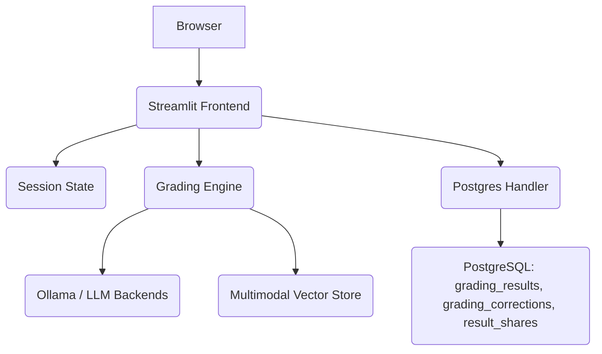

# Application Architecture

This document reflects the current codebase of the LLM AutoGrader project. It explains how the Streamlit frontend, grading engine, and persistence layer work together today.

---

## 1. High-Level Overview

* **Streamlit Frontend:** Multi-page UI that handles authentication, data upload, grading review, collaboration, and analytics.
* **Session State:** Temporary in-memory store (per user session) that keeps parsed professor data, student submissions, and grading results until they are persisted.
* **Grading Engine:** Python modules under `grader_engine/` that normalize inputs, call Ollama-hosted models, and compute rubric-aligned scores.
* **Vector Store:** An in-memory `MultimodalVectorStore` (Sentence Transformers or TF-IDF fallback) used for lightweight retrieval-augmented context during grading.
* **Database:** PostgreSQL tables managed via `database/postgres_handler.py` store finalized grading outputs, manual corrections, and sharing metadata.

---

## 2. Frontend (Streamlit Application)

### 2.1 Page Structure

* `app.py` – Root page with platform overview.
* `pages/0_auth.py` – Professor registration and login backed by PostgreSQL.
* `pages/1_upload_data.py` – Upload professor rubric PDF and student submissions (PDF or ILIAS ZIP). Parsed content is normalized and saved in `st.session_state`.
* `pages/2_grading_result.py` – Runs automated grading, displays rubric breakdowns, allows manual edits, and exports feedback packages.
* `pages/3_collaboration_center.py` – Manage sharing of individual grading results with colleagues.
* `pages/3_dashboard.py` – Analytics portal powered by pandas and Plotly.
* `5_my_profile.py` – Profile management helper (optional in navigation).

### 2.2 Session-Scoped Data Flow

During uploads, professor metadata and per-student answers are kept only in `st.session_state`. No ingestion tables (`prof_data`, `student_data`) exist in the database yet; persistence happens later when grading results are stored.

---

## 3. Persistence Layer

All long-term storage is handled through `database/postgres_handler.py`, which initializes and interacts with the following tables:

* `grading_results` – Stores AI-generated scores, feedback, serialized student answers, language, and metadata.
* `grading_corrections` – Audit trail of manual overrides made from the grading results page.
* `result_shares` – Mapping of which professor shared which grading result with which colleague.

Connection management uses a simple `psycopg2` connection pool. Inserts and updates are executed synchronously when grading completes or when a professor saves edits.

---

## 4. Grading Engine (`grader_engine/`)

* `text_grader.py` – Builds rubric-aligned prompts and calls Ollama (default `mistral`) twice. Results are interpreted with a structured output parser and normalized to rubric scores.
* `math_grader.py` – Lightweight LaTeX-aware scorer for numeric/analytical questions.
* `code_grader.py` – Executes Python code via subprocess in a temporary directory (no Docker). Supports rubric-weighted unit test scoring and simple fallbacks (syntax check and smoke run).
* `multi_agent.py` – Provides the `grade_block` entry point. It classifies the question, gathers RAG context, calls the appropriate grader, and fuses duplicate runs to estimate disagreement. Despite the filename, grading currently performs sequential duplicate evaluations rather than true concurrent multi-agent consensus.
* `multimodal_rag.py` – Implements the in-memory vector store with tiered backends (Sentence Transformers, TF-IDF, or no-op).

---

## 5. Retrieval-Augmented Grading

The vector store is seeded during professor upload (`pages/1_upload_data.py`) with question text, normalized ideal answers, and rubric items. During grading, `grade_block` pulls up to `k` similar items for additional context.

* Embeddings are kept in memory for the active Streamlit session only.
* There is no automatic persistence to FAISS/Chroma or background rebuild after manual corrections.
* If Sentence Transformers fail to load, the store transparently falls back to TF-IDF similarity or a no-op mode.

---

## 6. Human-in-the-Loop Editing

On the grading results page, professors adjust rubric sliders and feedback text areas. Pressing **Save changes** persists the new totals and feedback to `grading_results` and logs the edit in `grading_corrections`. A correction does not currently trigger a vector-store update.

Sharing options allow a stored result to be made available to another professor via the `result_shares` table.

---

## 7. Analytics and Reporting

`pages/3_dashboard.py` aggregates `grading_results` and shared items into pandas DataFrames and renders:

* Student performance summaries and quadrant analysis.
* Question-level distributions and difficulty trends.
* Calendar heatmaps of grading activity.
* Export options (CSV download, PDF summary via ReportLab).

The dashboard relies on columns populated by the grading workflow (course, semester, assignment number, language, etc.). Missing metadata defaults to "Unknown" for plotting.

---

## 8. Authentication & Profile Management

* Registration enforces university email domains and stores bcrypt hashes in a `professors` table (created manually alongside the shipped schema).
* Successful login stores the professor profile in `st.session_state['logged_in_prof']`.
* Profile components use `PostgresHandler` helper methods to manage subjects, sessions, and password updates.

---

## 9. Known Gaps & Future Enhancements

* Database ingestion tables (`prof_data`, `student_data`) are not yet implemented; all parsing happens in memory.
* True multi-agent grading (parallel personas with consensus) is a roadmap item; the current system performs redundant runs for stability.
* Manual corrections do not refresh the retrieval store. Extending `rag_utils.py` to append corrections is a planned improvement.
* A Streamlit-based fine-tuning assistant and `training/` workflow are not part of the current repository snapshot.
