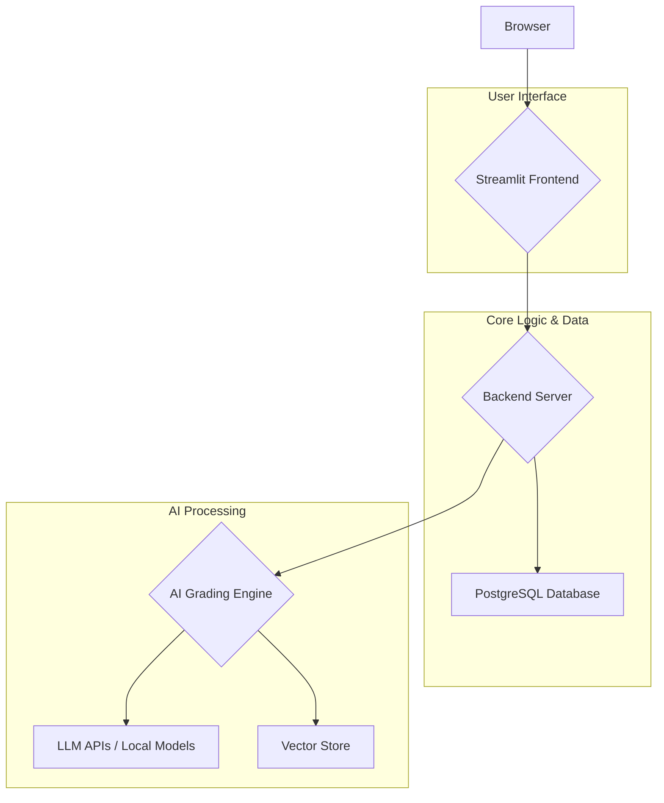

# Application Architecture

This document provides a detailed overview of the technical architecture of the automated grading application. It is intended for developers and system administrators.

---

## 1. High-Level Overview

The application is a multi-tiered system composed of a web-based frontend, a robust backend with a relational database, and a sophisticated AI-powered grading engine. 

*   **Frontend:** A multi-page Streamlit application provides the user interface for professors and teaching assistants.
*   **Backend:** A Python backend orchestrates the application logic, handling user requests, database interactions, and calls to the grading engine.
*   **Database:** A PostgreSQL database stores all persistent data, including user information, assignment details, student submissions, and grading results.
*   **AI Grading Engine:** A modular engine that leverages Large Language Models (LLMs) to perform the grading. It includes specialized modules for different types of assignments.
*   **Vector Store:** A FAISS-based vector database stores embeddings of past grading decisions to provide historical context (RAG).

---

## 2. Frontend (Streamlit Application)

The frontend is built using Streamlit and is organized into a multi-page application structure.

### **2.1. Directory Structure**

*   `app.py`: The main entry point of the Streamlit application. It handles routing and global configuration.
*   `pages/`: This directory contains the individual pages of the application, such as:
    *   `0_auth.py`: User authentication.
    *   `1_upload_data.py`: Interface for professors to upload assignment PDFs and for students to submit their work.
    *   `2_grading_result.py`: Displays the results of the grading process.
    *   `3_fine_tuning.py`: The user-friendly interface for fine-tuning the model.

### **2.2. Authentication and Session Management**

Authentication is managed through the `auth` module. User session data, including login status and user roles, is stored in `st.session_state`. This ensures that sensitive pages are protected and that the application context is maintained as the user navigates between pages.

---

## 3. Backend and Database

The backend logic is tightly integrated with the PostgreSQL database, which serves as the single source of truth.

### **3.1. Database Schema**

The database consists of several key tables:

*   `users`: Stores user credentials and roles (e.g., professor, assistant).
*   `prof_data`: Contains the data uploaded by professors, including the course, assignment number, questions, ideal answers, and grading rubrics.
*   `student_data`: Stores student submissions, linked to a specific assignment.
*   `grading_results`: This is the central table for storing the output of the grading engine. It includes the original student answer, the AI-generated score and feedback (`old_feedback`), and any human-in-the-loop corrections (`new_feedback`, `new_score`).

### **3.2. Data Handler (`database/postgres_handler.py`)**

All database interactions are abstracted away by the `PostgresHandler` class. This class provides a standardized interface for executing queries (SELECT, INSERT, UPDATE) and managing connections. This centralized approach ensures consistency and simplifies database management.

---

## 4. The AI Grading Engine (`grader_engine/`)

This is the core of the application where the AI-powered grading takes place. 

### **4.1. Router (`router.py`)**

The `Router` is the main entry point for the grading engine. It inspects the assignment type (e.g., text, code, multimodal) and directs the request to the appropriate specialized grader.

### **4.2. Multi-Agent Grader (`multi_agent.py`)**

To improve reliability and reduce bias, the system employs a multi-agent consensus mechanism:

1.  **Agent Roles:** Multiple LLM agents are instantiated with slightly different personas (e.g., a "strict" grader, a "lenient" grader, a "by-the-book" grader).
2.  **Concurrent Grading:** These agents grade the same submission in parallel using `concurrent.futures`.
3.  **Consensus:** The scores and feedback from each agent are collected. The final score is typically the mean or median of the agents' scores, and the variance is used as a confidence metric.
4.  **Final Review:** A final "meta-agent" reviews the collected feedback and synthesizes it into a single, high-quality explanation.

### **4.3. Code Grader (`code_grader.py`)**

The code grader provides a secure and comprehensive way to evaluate programming assignments:

1.  **Sandboxed Execution:** Student code is executed within a secure, isolated Docker container to prevent any potential security risks.
2.  **Unit Testing:** The code is run against a set of predefined `unittest` cases. The results (pass/fail) form the basis of the objective score.
3.  **Qualitative Feedback:** An LLM analyzes the student's code, along with the unit test results, to provide qualitative feedback on code style, efficiency, best practices, and potential areas for improvement.

### **4.4. RAG Integration (`rag_integration.py`)**

To ensure consistency over time, the grading engine uses Retrieval Augmented Generation (RAG):

1.  **Vector Store:** When a human-in-the-loop correction is made, the grading context (question, student answer, corrected feedback) is embedded and stored in a FAISS vector store.
2.  **Contextual Retrieval:** When grading a new submission, the engine queries the vector store to find the most similar previously graded examples.
3.  **Prompt Injection:** These historical examples are injected into the LLM prompt, providing valuable context that helps the model "remember" how similar cases were graded in the past.

### **4.5. Explainability Module (`explainer.py`)**

This module is responsible for generating the detailed, rubric-aligned justifications for the final score. It takes the grading results and structures them into a clear, easy-to-understand format that explains which criteria were met and why.

---

## 5. Model Management & Finetuning (`training/`)

The application is designed to allow for continuous improvement of the AI models through a user-friendly fine-tuning process.

### **5.1. Finetuning Workflow**

The new `pages/3_fine_tuning.py` page orchestrates this process:

1.  **Data Generation:** A user clicks a button to generate a `training_dataset.jsonl` file. The backend queries the `grading_results` table for all human-corrected examples and formats them into the required JSONL structure.
2.  **Colab Training:** The user uploads this dataset to Google Colab and runs a provided Python script (`training/colab_finetune.py`). This script handles the installation of dependencies, data preparation, and the MLX-based fine-tuning process.
3.  **Adapter Deployment:** The training script produces a `trained_adapters.npz` file. The user downloads this file and places it in the `training/` directory of the application.
4.  **Automatic Loading:** On startup, the application checks for the existence of `trained_adapters.npz`. If found, it automatically loads the fine-tuned LoRA adapters, enhancing the base model with the user's specific corrections.
