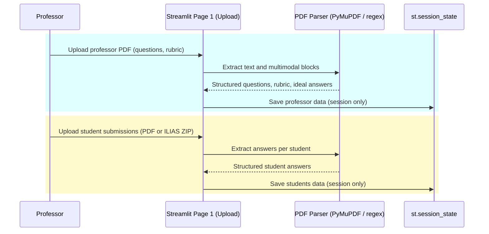
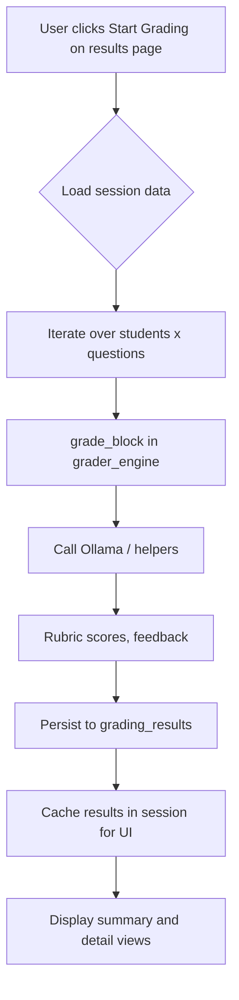
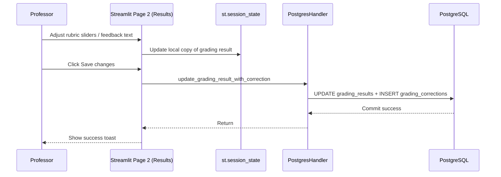
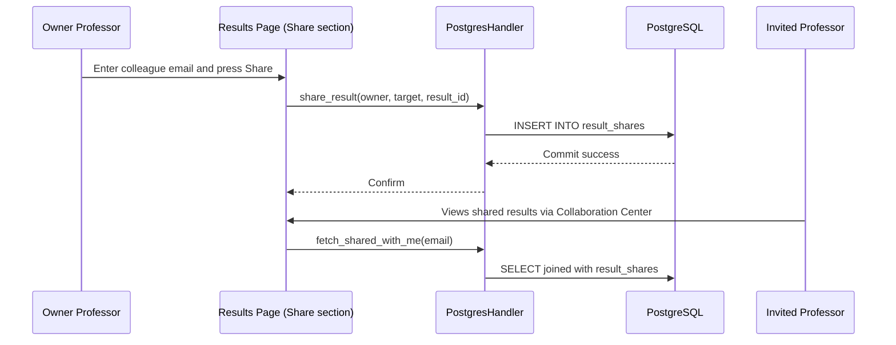

# Detailed Data Flow Diagrams

These diagrams describe how data moves through the current LLM AutoGrader implementation.

---

## 1. Upload & Ingestion Pipeline

Professor and student files are parsed client-side in Streamlit and stored in session state.



**Key Points**

1. No ingestion records are written to PostgreSQL at this stage.
2. The upload page validates that each student answer covers all rubric questions before allowing grading.
3. When grading begins, Streamlit navigates to the results page and reuses the session data.

---

## 2. Core Grading Pipeline



1. `grade_block` routes to the text, math, or code grader, runs duplicate evaluations, and returns a normalized payload.
2. The results page stores serialized responses (including rubric scores and student answer content) in PostgreSQL via `insert_or_update_grading_result`.
3. Results are also kept in `st.session_state['grading_cache']` to support interactive edits without re-running models.

---

## 3. Grading Engine Internals

```mermaid
graph TD
    A[grade_block] --> B{Router heuristics}
    B --> |code| C[code_grader (subprocess)]
    B --> |math| D[math_grader]
    B --> |text| E[text_grader]

    subgraph Text Path
        E --> F[Pull RAG context (MultimodalVectorStore)]
        F --> G[First LLM call]
        F --> H[Second LLM call]
        G --> I[Normalize scores]
        H --> I
    end

    C --> J[fuse()] 
    D --> J
    I --> J
    J --> K[Return final total, per-criterion scores, disagreement flag]
```

* Routing heuristics are simple regex-based checks (code fences, LaTeX tokens, keywords).
* The vector store is seeded when the professor PDF is processed; no additional writes happen during grading.
* `fuse` averages totals from duplicate runs and detects large disagreements (>2 points) for potential human review.

---

## 4. Human-in-the-Loop Editing & Persistence



* The UI only writes to the database when **Save changes** is pressed.
* Saved edits refresh the cached result in session without re-running the models.
* No RAG refresh happens after corrections (future enhancement).

---

## 5. Collaboration & Sharing



---

## 6. Analytics Workflow

```mermaid
graph TD
    A[Dashboard page load] --> B[PostgresHandler.fetch_my_results]
    B --> C[DataFrame Assembly]
    C --> D[Filter controls]
    D --> E[Plotly visuals]
    C --> F[CSV export]
    C --> G[PDF summary (ReportLab)]
```

* Analytics runs live queries each time the page loads or filters change.
* Missing metadata fields are normalized to "Unknown" before plotting.
* Download buttons allow exporting the filtered dataset or a generated PDF report.

---

## 7. Known Limitations (Documented)

* Upload data is not persisted; refreshing the browser clears session state.
* Manual corrections do not update the in-memory retrieval store.
* The current grading engine runs duplicate model calls sequentially rather than concurrently.
* There is no built-in fine-tuning assistant in this code snapshot; model adaptation is a future roadmap item.
