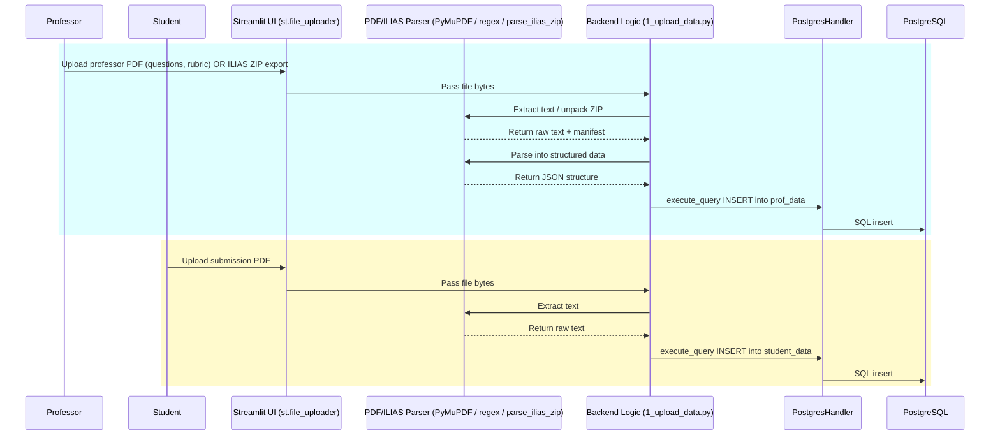
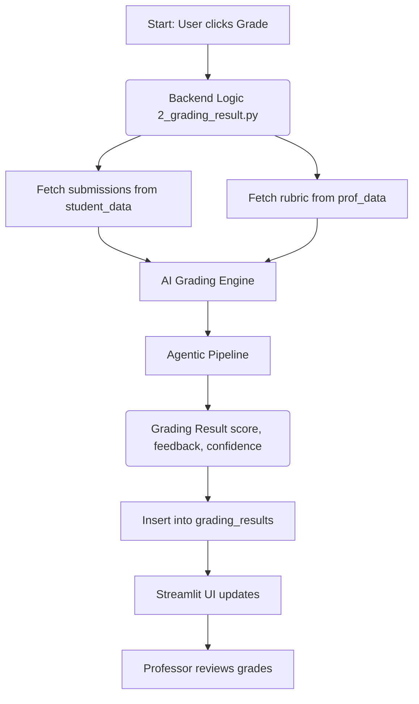
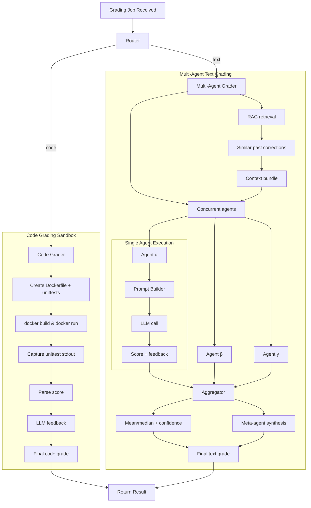
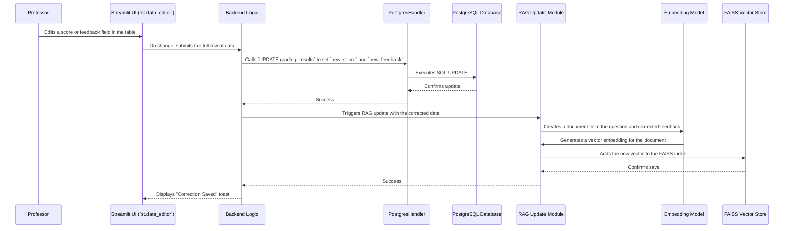
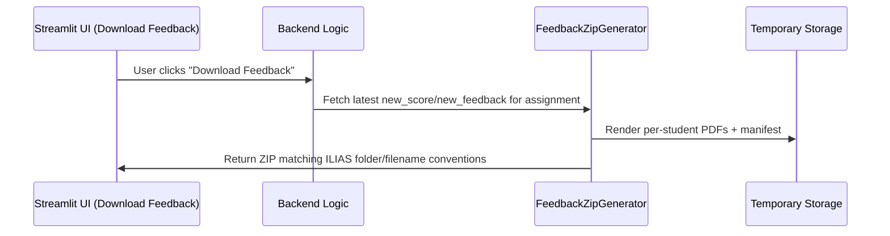

# Detailed Data Flow Diagrams

This document provides a series of detailed diagrams illustrating the data flow through every major pipeline in the Automated Grading Framework. 

---

## 1. Data Ingestion Pipeline (ETL)

This pipeline describes how course materials (from professors) and student submissions are processed from raw PDFs or ILIAS LMS archives into structured, queryable data in the PostgreSQL database.

**Description:**

The ingestion process happens in two distinct (but similar) workflows:

*   **Professor Workflow:** 
    1. The professor uploads a PDF containing the assignment details.
    2. The backend uses `PyMuPDF` to extract text and regular expressions (`re`) to parse it into a structured format (questions, rubric, etc.).
    3. The structured data is saved to the `prof_data` table in the PostgreSQL database.

*   **Student Workflow:**
    1. The student uploads their submission as a PDF.
    2. The backend uses `PyMuPDF` to extract the raw text of their answer.
    3. This text is saved to the `student_data` table, linked to the appropriate assignment.

*   **ILIAS Workflow (Professor and Students combined):**
    1. An instructor uploads a full ILIAS ZIP export containing assignment context and student submissions.
    2. `parse_ilias_zip` unpacks the archive, normalises filenames, maps each submission to a student ID, and surfaces a manifest/coverage preview in the UI.
    3. Parsed questions/criteria flow into `prof_data`, and per-student files are stored in `student_data`, ready for grading with no manual renaming.

---

## 2. Core Grading Pipeline

This diagram shows the end-to-end process when a professor initiates a grading job, culminating in the results being displayed on the screen.

**Description:**
1.  The process begins when the user starts a grading job from the Streamlit UI.
2.  The backend fetches the relevant student submissions and the corresponding professor-defined rubric from the PostgreSQL database.
3.  This data is dispatched as a job to the **AI Grading Engine**.
4.  The engine performs the complex grading task (detailed in the next section).
5.  The final, aggregated result is returned to the backend.
6.  The backend saves this result to the `grading_results` table for persistence.
7.  The UI is updated to display the new grades in an editable table, completing the flow.

---

## 3. Agentic Grading Engine Pipeline (Deep Dive)

This diagram provides a detailed look inside the AI Grading Engine itself, showing how a single submission is processed by the multi-agent system.

**Description:**
*   **Routing:** The engine first routes the job based on the assignment type.
*   **Code Grading:** For code, it enters a secure Docker sandbox to run unit tests for an objective score, then uses an LLM to generate qualitative feedback on the code itself.
*   **Text Grading:** For text, the process is more complex:
    1.  **RAG:** The RAG module first retrieves relevant historical grading examples from the FAISS vector store.
    2.  **Concurrent Grading:** Multiple AI agents, each with a different persona, are spawned in parallel. They each receive the submission, the rubric, and the context from the RAG module.
    3.  **Aggregation:** Once all agents complete, their individual scores are statistically aggregated (e.g., taking the median). The variance in their scores is used as a confidence metric.
    4.  **Synthesis:** A final "meta-agent" reviews the feedback from all other agents and synthesizes it into a single, high-quality, comprehensive piece of feedback for the student.

---

## 4. Human-in-the-Loop (HITL) & RAG Update Pipeline

This pipeline shows what happens when a professor makes a correction to an AI-generated grade. This is a critical feedback loop for the system.

**Description:**
1.  The professor edits a grade directly in the Streamlit UI.
2.  The backend receives the corrected data.
3.  It first updates the `grading_results` table in the PostgreSQL database, preserving both the original AI grade (`old_feedback`) and the new human-verified grade (`new_feedback`).
4.  Next, this correction is used to improve the RAG system. The corrected feedback is converted into a vector embedding.
5.  This new vector is added to the FAISS vector store, making this human-verified example available for all future grading tasks to improve their context and accuracy.

---

## 5. Feedback Export Pipeline (ILIAS-Compatible ZIP)

This flow shows how reviewed grades are packaged for LMS re-upload.

**Description:**
1. From the grading page, the instructor clicks **Download Feedback**.
2. The backend gathers the latest `new_score`/`new_feedback` rows for each student.
3. `FeedbackZipGenerator` renders per-student PDFs and builds a ZIP using the ILIAS naming and folder structure.
4. The UI streams the ZIP so the instructor can upload it back to ILIAS without manual file renaming.
